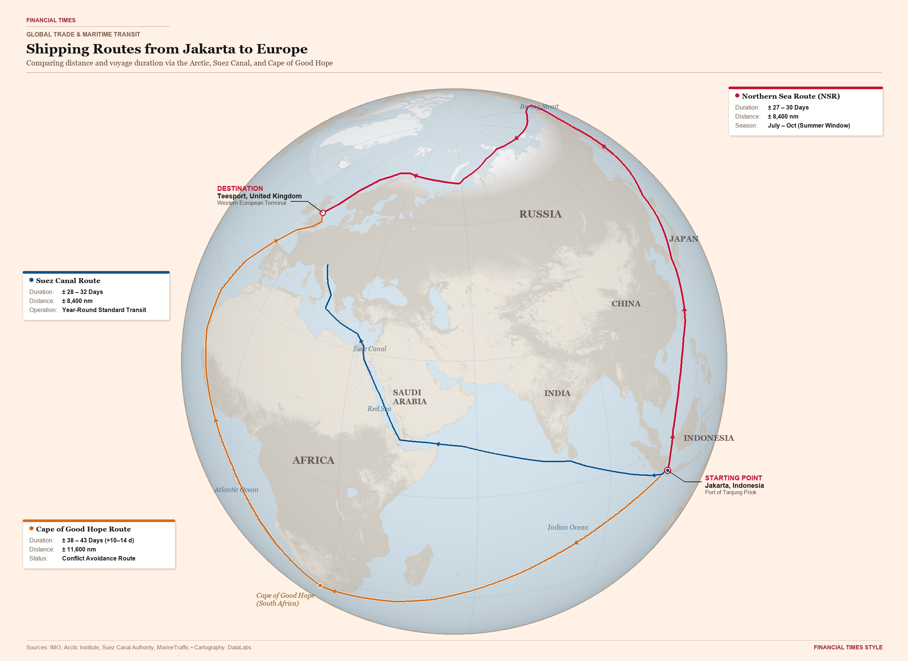
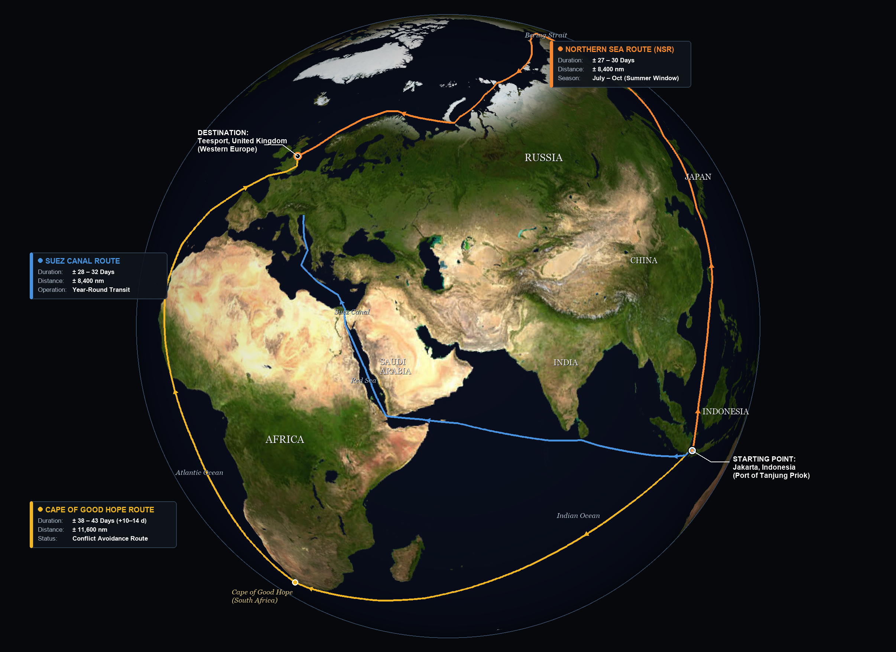

# Global Maritime Shipping Routes Comparison: Jakarta to Europe

A 3D orthographic globe visualization and geospatial analysis comparing three major maritime shipping routes from **Jakarta, Indonesia (Port of Tanjung Priok)** to **Western Europe (Teesport, United Kingdom)**:

1. **Northern Sea Route (Arctic Route / NSR)**
2. **Traditional Suez Canal Route (Red Sea)**
3. **Cape of Good Hope Route (Circumnavigating Africa)**

Inspired by Pablo Robles' (*The New York Times*) 3D globe cartography using the QGIS `GlobeBuilder` plugin, adapted and re-anchored for an Indonesian departure point.

---

## 🌍 Map Visualizations

### 📰 1. Editorial Light — Financial Times Style
Signature warm salmon paper (`#FFF1E5`), soft pastel blue oceans, muted slate terrain relief, delicate graticule grid lines, and high-contrast editorial route lines.



### 🌌 2. Editorial Dark — Pablo Robles / NYT Style
Deep space dark theme (`#06080B`), atmospheric limb glow, high-contrast neon vector route ribbons, and semi-transparent glassmorphism metric cards.



---

## 📊 Route Comparison Summary

| Metric | 🟠 Northern Sea Route (NSR) | 🔵 Suez Canal Route | 🟡 Cape of Good Hope Route |
| :--- | :--- | :--- | :--- |
| **Total Distance** | **± 8,400 nm** (~15,550 km) | **± 8,400 nm** (~15,550 km) | **± 11,600 nm** (~21,480 km) *(+3,200 nm)* |
| **Estimated Transit** | **± 27 – 30 Days** | **± 28 – 32 Days** *(Standard)*<br>*(up to 36 d with winter weather)* | **± 38 – 43 Days** *(+10 – 14 days delay)* |
| **Cruising Speed** | 14–15 kts (Asia & Atlantic)<br>8–11 kts (Arctic ice waters) | 13–15 kts (continuous cruising) | 14–16 kts (open ocean cruising) |
| **Primary Route Path** | Java Sea → South China Sea → Taiwan Strait → Sea of Japan → Bering Strait → Russian Arctic NSR → UK | Sunda Strait → Indian Ocean → Gulf of Aden → Red Sea → Suez Canal → Mediterranean → UK | Sunda Strait → South Indian Ocean → Cape Agulhas/Good Hope → South & North Atlantic → UK |
| **Key Chokepoints & Hazards** | Taiwan Strait, Bering Strait, Vilkitsky Strait (Arctic ice floes) | Sunda Strait, Bab-el-Mandeb, Suez Canal | Heavy Southern Ocean swells / storms at Cape of Good Hope |
| **Navigability Window** | **Summer Only** (July – October) | **Year-Round** (12 months) | **Year-Round** (12 months) |
| **Major Operational Costs** | Ice-class hull (*Arc4/Arc7*), Russian icebreaker escort tariffs | Suez Canal toll fees, Red Sea war-risk insurance premiums | Significantly higher bunker fuel consumption (+35–40%) |

---

## 🔍 Detailed Route Analysis

### 1. 🟠 Northern Sea Route (NSR / Arctic)
* **Path:** Departs Tanjung Priok heading north through the Java Sea, South China Sea, and Taiwan Strait, continues past Japan and through the Bering Strait into the Chukchi, East Siberian, Laptev, Kara, and Barents Seas before descending around Scandinavia into the UK.
* **Strategic Value:** Equal in distance to the Suez route (~8,400 nm), but requires specialized ice-class vessels (*Arc4* to *Arc7*) and Russian icebreaker escort fees.
* **Operational Constraint:** Viable primarily during the brief Arctic summer thaw (July–October).

### 2. 🔵 Traditional Suez Canal Route
* **Path:** Departs Tanjung Priok westbound through the Sunda Strait, crosses the Indian Ocean, enters the Gulf of Aden and Bab-el-Mandeb Strait, transits the Red Sea and Suez Canal, and navigates through the Mediterranean and English Channel to the UK.
* **Strategic Value:** The historical primary trade corridor connecting Southeast Asia to Western Europe, operating continuously year-round.
* **Geopolitical Challenge:** Vessel transits through the southern Red Sea face elevated war-risk insurance premiums and security threats, prompting widespread diversions.

### 3. 🟡 Cape of Good Hope Route (Circumnavigation)
* **Path:** Departs Tanjung Priok through the Sunda Strait, steers southwest across the open South Indian Ocean, rounds Cape Agulhas and the Cape of Good Hope at the southern tip of Africa (~35°S), then sails north across the entire South and North Atlantic Oceans to the UK.
* **Strategic Value:** The primary conflict-avoidance alternative bypassing the Red Sea and Suez Canal.
* **Trade-off:** Adds **+3,200 nautical miles** (~5,900 km) and **+10 to 14 extra transit days**, consuming ~35–40% more bunker fuel while encountering severe weather and swells in the Southern Ocean (*Roaring Forties*).

---

## 🧭 Cartographic & Projection Specifications

To depict both the Arctic high latitudes and the southern tip of Africa simultaneously without severe edge distortion or hemisphere clipping:

* **Projection:** Azimuthal Orthographic (`+proj=ortho +lat_0=30 +lon_0=55 +datum=WGS84 +units=m +no_defs`)
* **Center Vantage Point:** `30.0° N, 55.0° E`
  * *Mathematical Rationale:* From this viewpoint, Cape of Good Hope (`34.5°S, 18.5°E`), Jakarta (`6.1°S, 106.9°E`), the Bering Strait (`66.0°N, 169.0°W`), and the United Kingdom (`54.6°N, 1.2°W`) all lie within an angular central distance $\gamma < 85^\circ$, ensuring every route remains completely visible on a single hemisphere globe disk.
* **Origin:** Port of Tanjung Priok, Jakarta, Indonesia (`-6.10° S, 106.88° E`)
* **Destination:** Port of Teesport, United Kingdom (`54.60° N, -1.15° W`)

---

## 📁 Repository Structure

```text
├── README.md                           # Documentation & analytical breakdown
├── arctic_shipping_route_ft.png        # Financial Times broadsheet style rendered map (2412 x 1756)
├── arctic_shipping_route_globe.png     # Editorial dark style rendered 3D globe map (2412 x 1756)
├── arctic_shipping_route.qgs           # Native QGIS project with pre-configured layers & symbology
├── build_map_ft.py                     # Financial Times style cartographic renderer
├── build_map.py                        # Editorial dark style cartographic renderer
├── create_qgis_project.py              # Script generating the native QGIS project via PyQGIS
├── cape_route.geojson                  # GeoJSON linestring: Jakarta → Cape of Good Hope → UK
├── northern_sea_route.geojson          # GeoJSON linestring: Jakarta → Bering Strait → Arctic → UK
├── suez_route.geojson                  # GeoJSON linestring: Jakarta → Suez Canal → UK
├── ports_and_waypoints.geojson         # Waypoints for origin, destination, and chokepoints
├── earth_5400.jpg                      # Base Earth texture
└── land_topo_2048.jpg                  # Topographic relief texture
```

---

## 🚀 Reproduction & Setup

### Prerequisites
* Python 3.9+
* Required Python libraries:
  ```bash
  pip install pillow numpy
  ```

### Generate the Maps
* **Financial Times Style (Light & Warm Paper):**
  ```bash
  python build_map_ft.py
  ```
* **Editorial Dark Style (NYT / Deep Space):**
  ```bash
  python build_map.py
  ```

### Open in QGIS
1. Install [QGIS 3.x or 4.x](https://qgis.org/).
2. Open [`arctic_shipping_route.qgs`](arctic_shipping_route.qgs) directly in QGIS.
3. The project includes pre-configured CRS (`+proj=ortho +lat_0=30 +lon_0=55`), styling rules, and route layers.

---

## 📜 Acknowledgements & References
* Inspired by the 3D globe visualization by **Pablo Robles** (*The New York Times*) published on Substack.
* Globe visualization techniques using the [GlobeBuilder](https://github.com/osgeosuomi/GlobeBuilder) QGIS plugin by OSGeo Suomi.
* Global basemap textures and geospatial boundaries courtesy of NASA Earth Observatory and Natural Earth.
